[Ruben Schade recently wrote](https://rubenerd.com/flight-simulator-98-inside-out/) about a Flight Simulator 98 book. It seems he values it, but not nearly as much as the simulation game itself.

That got me thinking: there is an old book about Microsoft Flight Simulator (but the earlier version 5) on my shelf that I won't ever get rid of. It made a huge impression on teenage me, because it offered a glimpse into a world that I had no access to otherwise: professional aviation. I played Flight Simulator quite a bit; I've never been good, but flying under the Golden Gate or landing on USS Nimitz were highlights I had always enjoyed. Reading about the game and its simulated real-life counterparts were probably much more formative for me, though. Let's take a look!

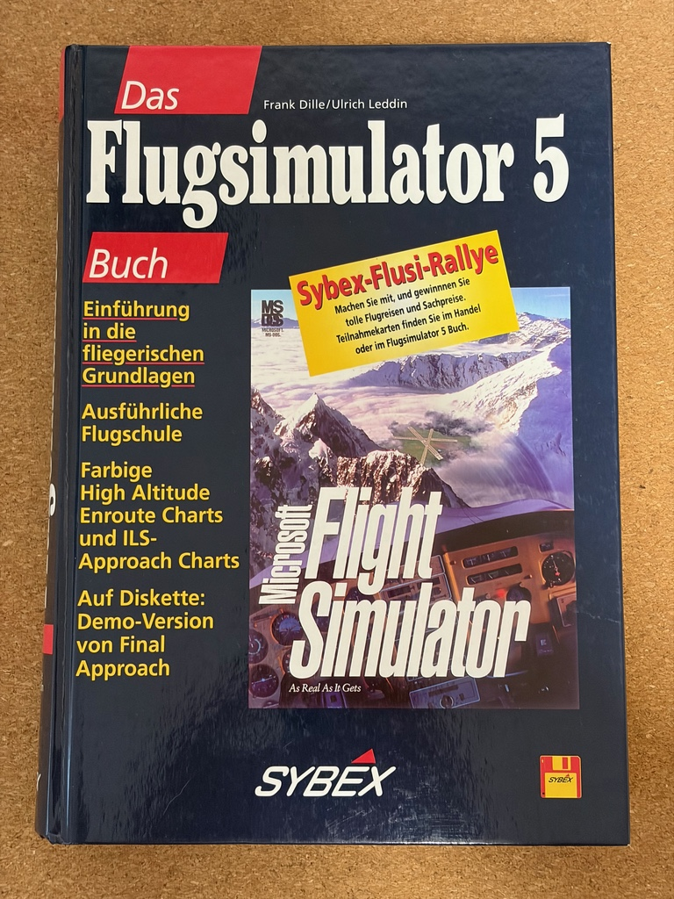

We start with some physics. Proper fundamentals and all that. The chapter isn't math heavy, but it does show some simple formulas:

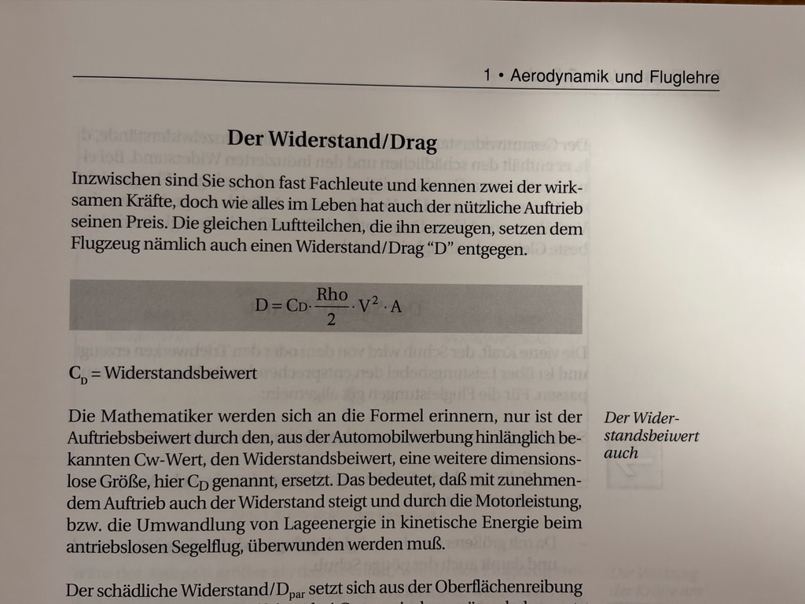

There are all kinds of diagrams showing airplane parts and the proper nomenclature. Aren't those labels cute? Is that hand-lettering?

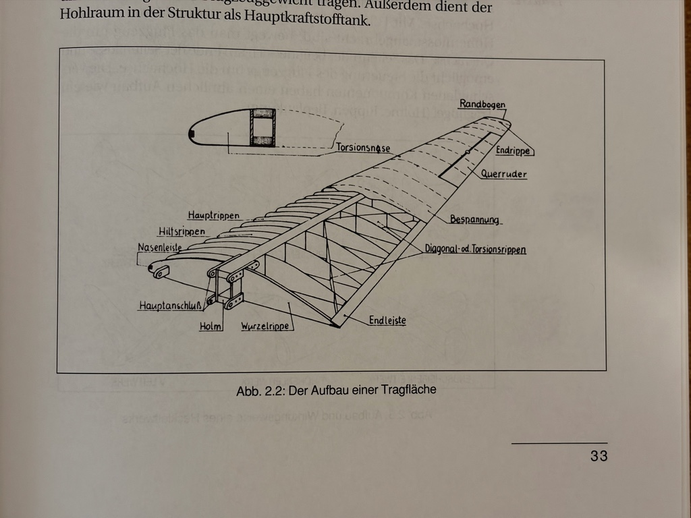

Obviously, we can't start playing the sim, yet! First a look around the cockpit, with descriptions of all the instruments.

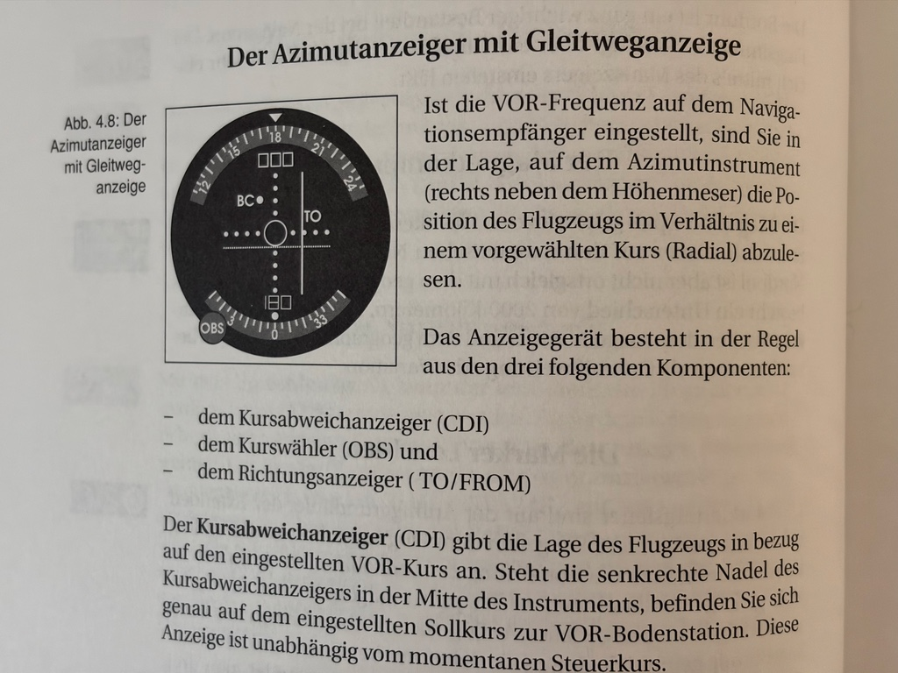

The Learjet has different kinds of instruments from the Cessna, so let's see those, as well.

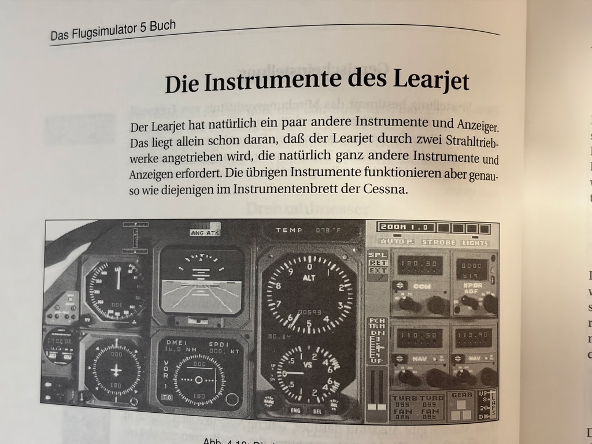

Let's fly! No. First we need to know about meteorology and cloud formations.

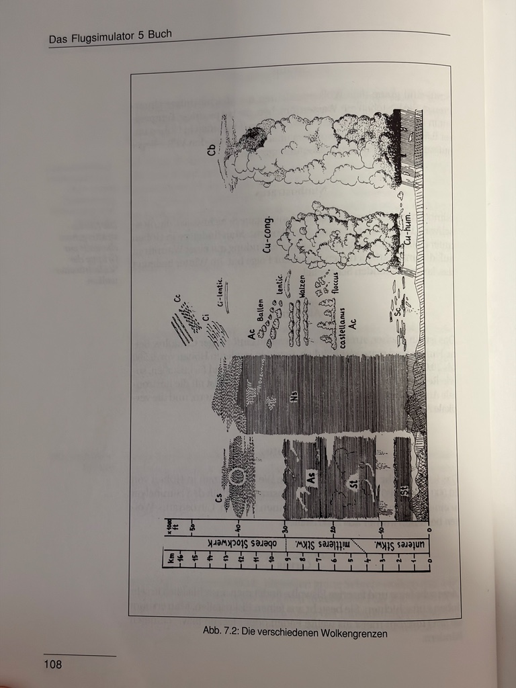

You did notice that we have crossed the 100 page mark and still no play in sight?

Because now we need to learn about navigation. With pencil and ruler on paper.

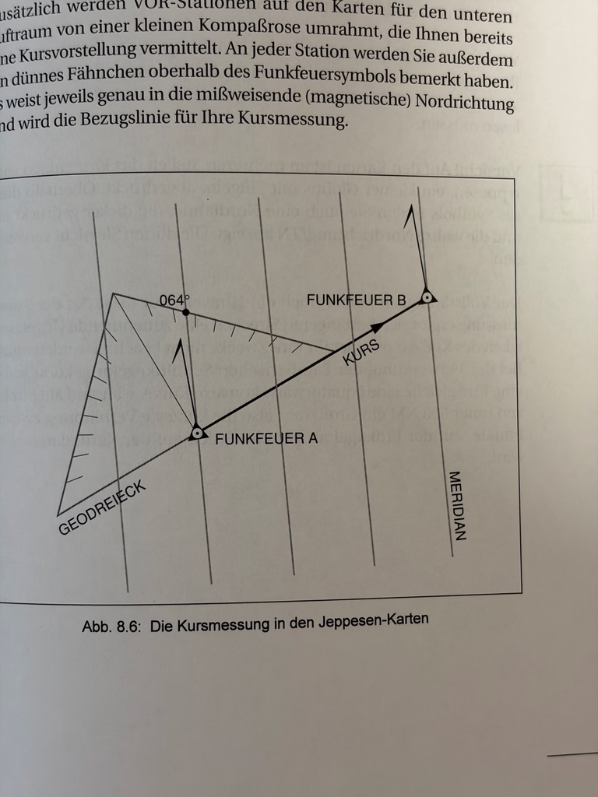

You may have already seen it on the cover, but the book carries two Jeppesen flight charts in its back sleeve. They were out-of-date and not flightworthy even when the book came out, but that's what I like about this book: it takes you seriously. They got the real deal, not some simplified “in general it looks a bit like” map.

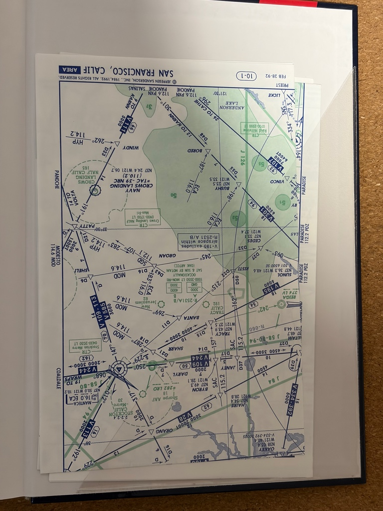

This is a German book. So now we get a short overview of aviation laws and regulations. Because of course we do.

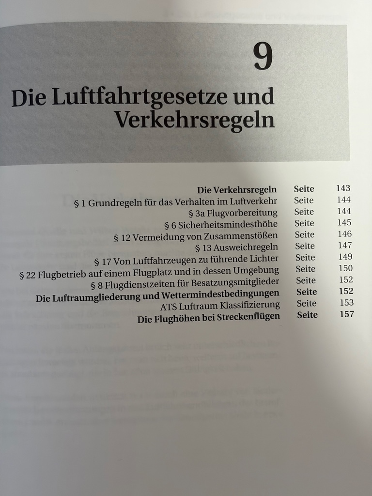

Including the structure of airspace over American airports. I remember that I was absolutely fascinated by this diagram.

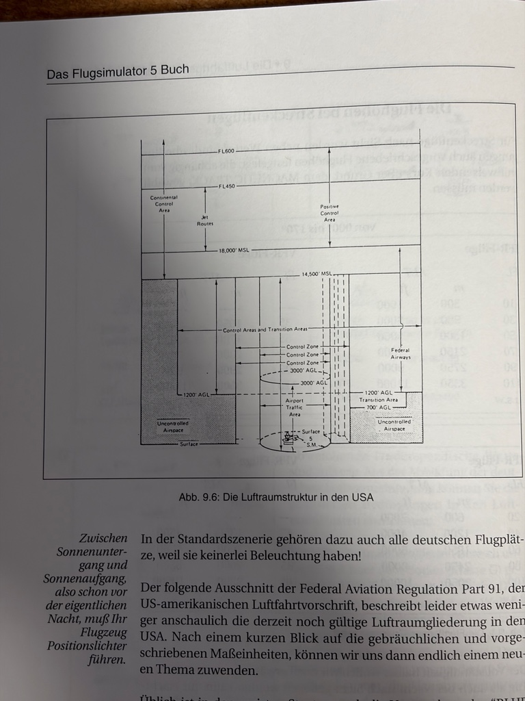

Almost there! We're going to fly now. But first, the outside check. I think 
 the most we could do in the game was looking at the airplane from different directions and checking that the lights were on. 

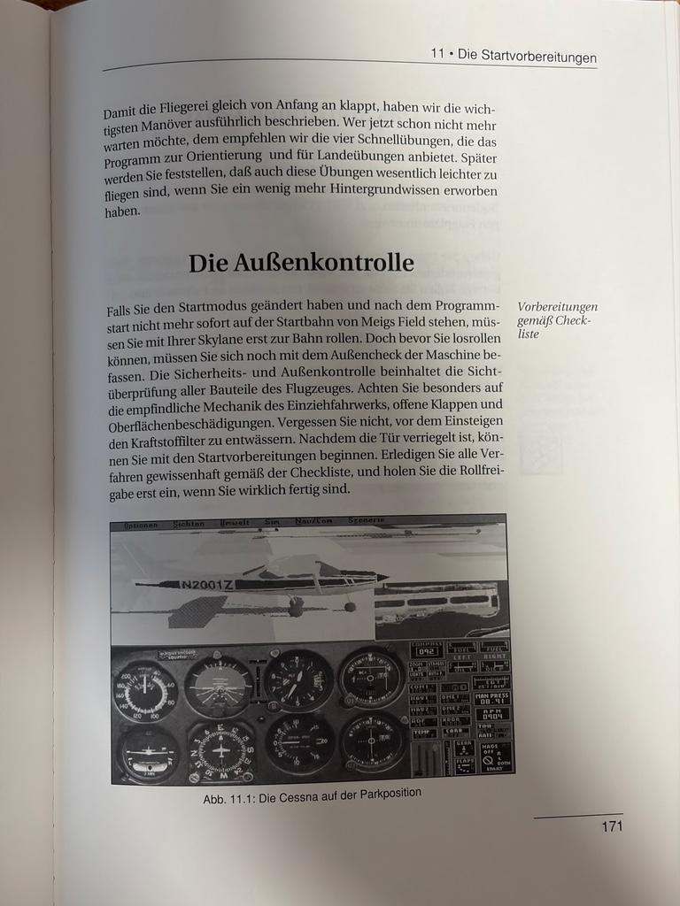

So around page 170 we finally get to fly our airplane. And, of course, we get several variations, including a short takeoff in case a fuel truck cuts right before us. The book gives concrete directions how to configure all relevant parts of the airplane, so you will succeed in all manoeuvres it teaches you throughout the book.

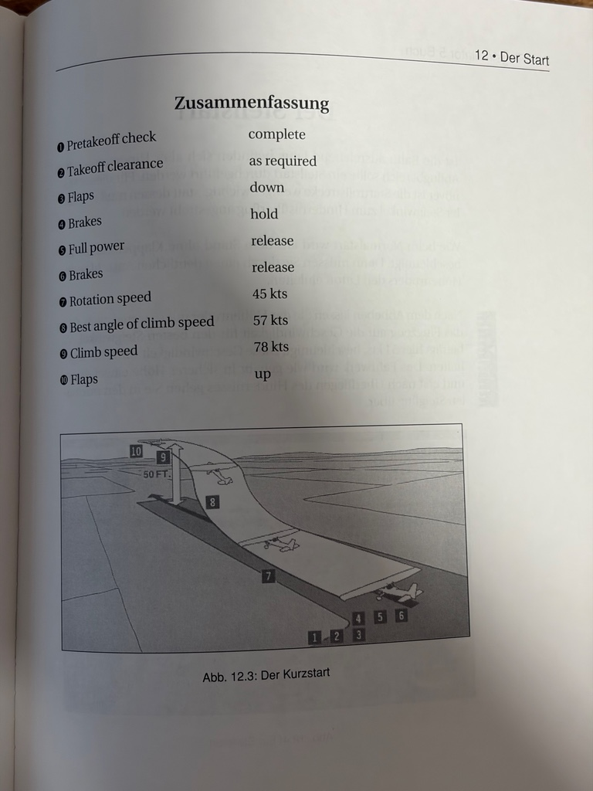

We do all kinds of flying (climbing, level flight, approach, landing with or without crosswinds, holding patterns), and around page 280 we're finally done with the Cessna.

A short chapter about emergencies follows.

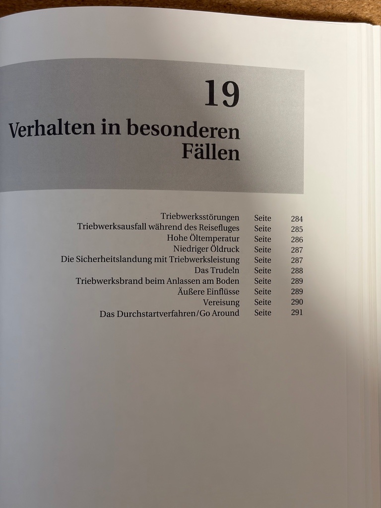

The Learjet chapters are shorter, building on what we have learned in the Cessna chapters, and mostly introducing new concepts like instrument flight rules and radio navigation.

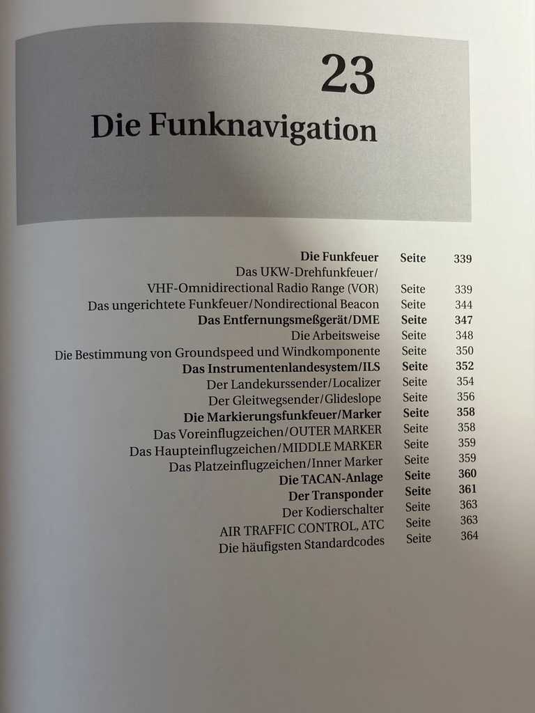

I may have been a bit sarcastic here and there, but I must re-emphasize: this book is fantastic! The best Flight Simulator book I could have hoped for. I am perfectly frank when I'm saying I won't chuck it. Ever.
