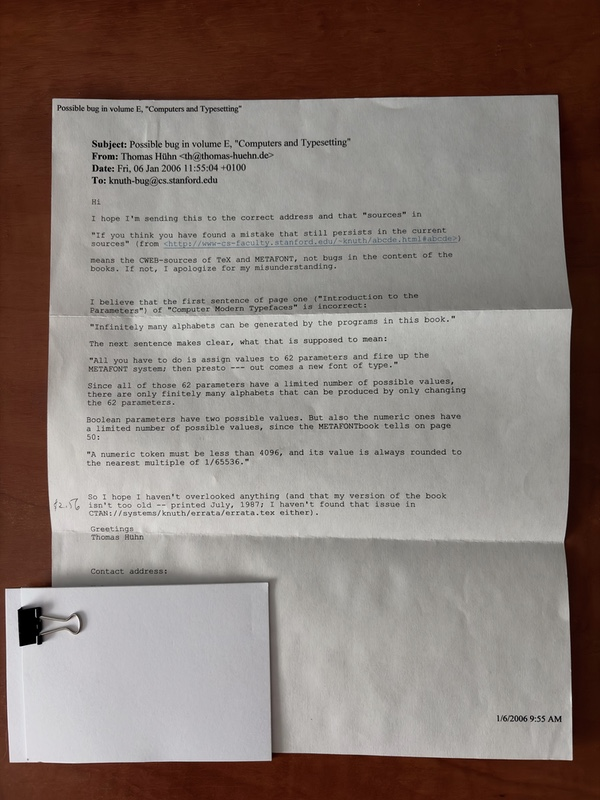
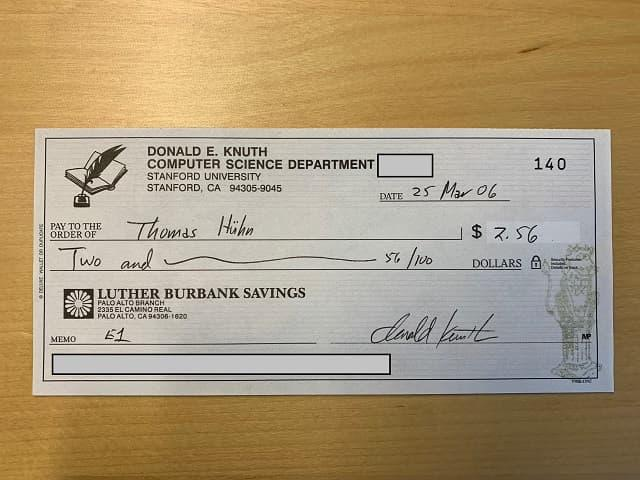

It's been twenty years now that I've gotten one of the best letters ever. Donald Knuth confirmed the error I had found in one of his books and sent me [the coveted check!](https://en.wikipedia.org/wiki/Knuth_reward_check)

Donald Knuth and his reward for any error in one of his books (even typographical ones) are computer science folklore. Preposterous to think that I could possibly earn one! His books have been combed through by thousands and thousands of people. Smarter people than I am. More patient people.

And then it happened. I thought I had found an error. But I did not report it right away, I waited and re-checked it for months, lest I make a fool of myself. I even told our local genius at university who did not care much and dismissed my excitement.

See, the error I found is in a very special place. The book is “Computer Modern Typefaces”, so it's a less read book (not the TeXbook or The Art of Computer Programmming), but still, practically everybody who has given that book a shot will have read over that error.

Because it's on page Arabic one. In the first paragraph. The very first word.

That's why the Memo field says “E1”: Computer Modern Typefaces is Volume E in the Computers & Typesetting series. Page 1.

I have censored the check slightly, because Knuth is afraid someone might do bad things with those numbers, and he hasn't been handing out real checks for many years now. Today you get a fantasy certificate of a fantasy bank, the [Bank of San Serriffe](https://www-cs-faculty.stanford.edu/~knuth/boss.html).

But why will you find me there with the entry “0x$1.20”, i.e. decimal $2.88? A few years later I sent in another proposed error, but I was wrong. Knuth actually wrote a few paragraphs why exactly I'm wrong, but because he counted some throwaway sentence in my bug report as a good suggestion, I got another check for $0.32.
